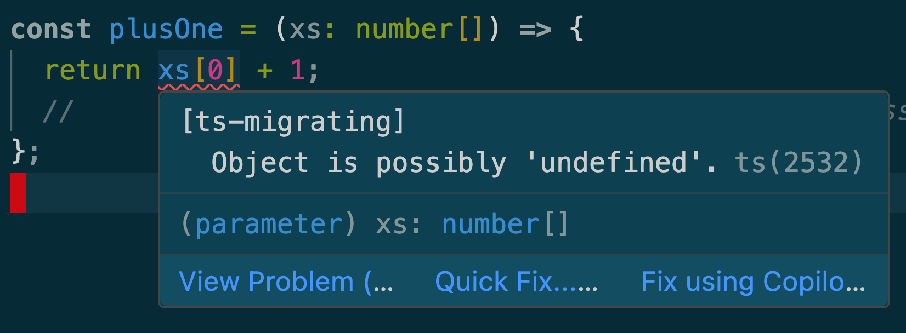
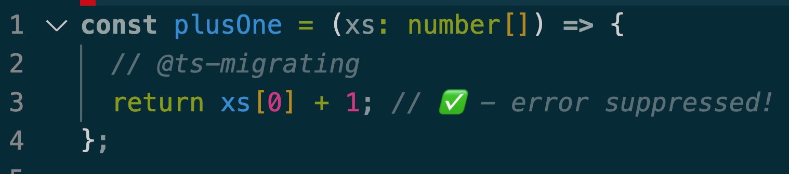

# `@ts-migrating` — Progressively Upgrade `tsconfig.json`

🚀 **TypeScript keeps evolving — and your `tsconfig` should too.**

This plugin lets you upgrade to your desired `compilerOptions` (e.g. `strict`, `noUncheckedIndexedAccess`, `erasableSyntaxOnly`, `checkJs`) across your entire codebase, while letting problematic lines fall back to the old `compilerOptions`.

Upgrading `tsconfig` often breaks existing code, and fixing all errors at once is unrealistic.

**`@ts-migrating`** helps your team migrate to a desired `tsconfig` gradually and safely.

> I chose `@ts-migrating` (rather than `@ts-migration`) to better reflect the plugin’s progressive and incremental philosophy.

## 🙋‍♀️ Why not `@ts-expect-error` / `@ts-ignore`?

Using `@ts-expect-error` or `@ts-ignore` to silence TypeScript errors can work in the short term — but they come with trade-offs:

- They suppress all errors on the line, not just those introduced by the new `compilerOptions`. This can hide unrelated issues and introduce technical debt.
- There are cases where you actually want to use `@ts-expect-error` and `@ts-ignore`. Mixing their real usages with `tsconfig` migration is 🤮.

This plugin takes a different approach: it lets you apply the desired `compilerOptions` globally while allowing them to be reverted line-by-line. This keeps your code clean, and your intent clear — enabling a safer and more maintainable upgrade path.

## 🤖 How does this work?

`@ts-migrating` is a TypeScript plugin that lets you **enable your target tsconfig during development** (in IDEs or editors that use the [TypeScript Language Service](https://github.com/microsoft/typescript/wiki/Using-the-Language-Service-API)) and in CI — **without affecting `tsc` or your production build**.

The philosophy behind the plugin follows three simple steps:

1. 🛑 **Prevention**

   * Errors from your target config are surfaced during development and in CI.
   * This ensures no new violations are introduced into the codebase.

2. 🔧 **Reduction**

   * Lines marked with `@ts-migrating` will be typechecked with your original `tsconfig`. Ensuring type-safety throughout.
   * Developers can progressively fix these lines, reducing violations over time.

3. ✅ **Migration**

   * Once all violations are fixed, no `@ts-migrating` directives remain.
   * At this point, you're ready to fully adopt the new tsconfig — and the plugin has served its purpose.

## 📚 Overview

`@ts-migrating` consists of two parts:

1. 🔌 **[TypeScript Language Service Plugin](https://github.com/microsoft/TypeScript/wiki/Writing-a-Language-Service-Plugin)**

   * Enables IDEs to show errors from the `tsconfig` you're migrating to.
   * Revert lines marked with `@ts-migrating` to be type-checked with your original `tsconfig`.

2. 🖥️ **Standalone CLI: `ts-migrating`**

   * `ts-migrating check`

     * Run `@ts-migrating`-aware type checking using your new `tsconfig`.
     * Pass `--reporter json` (or `ndjson`) to emit a machine-readable report for CI gates and dashboards (see [📊 JSON reporting](#-json-reporting)).
   * `ts-migrating annotate`

     * Automatically mark all errors caused by your new `tsconfig` with `@ts-migrating`.
     * ⚠️ Run this with a clean git state!!! This script will automatically add the `@ts-migrating` directive above every line with TypeScript error introduced by your new `tsconfig`. Please review the changes carefully. It is recommended to run your formatter and linter afterwards. You may need to run this command again after formatter / linter.

## 🎪 Examples

* [Migrating to `strict`](./examples/strict-mode-migration/src/index.ts)
* [Migrating to `noUncheckedIndexedAccess`](./examples/no-unchecked-indexed-access-migration/src/index.ts):

  | Without `@ts-migrating` | With `@ts-migrating` |
  | ----------------------- | -------------------- |
  |   |   |

* [Migrating to `erasableSyntaxOnly`](./examples/erasable-syntax-only-migration/src/index.ts)
* [Migrating to `checkJs`](./examples/check-js-migration/src/index.js)

## 📦 Install and Setup

This project does **NOT** require any IDE extensions. It relies purely on TypeScript's own Language Service, so it works on most IDEs and editors that support TypeScript (e.g., VSCode, WebStorm).

To install:

```bash
cd my-cool-project
npm install -D ts-migrating
```

In your existing `tsconfig.json`, add the plugin:

```jsonc
{
  // ...
  "compilerOptions": {
    // ...
    "plugins": [
      {
        "name": "ts-migrating",
        "compilerOptions": {
          // ... put the compiler options you wish to migrate to, for example:
          "strict": true
        }
      }
    ]
    // ...
  }
  // ...
}
```

ℹ️ *Note: `plugins` only affect the TypeScript Language Service (used by IDEs). They do **not** impact `tsc` or your build.*

🎉 Your codebase is now ready!

### ✅ Verify the Setup

#### 🧑‍💻 In your IDE

* Restart the IDE, or just the TS server.
* Confirm that type errors now reflect the new `compilerOptions`. For example, when migrating to strict mode, verify that strict-specific errors appear.
* Add `// @ts-migrating` before a line with an error — the error should disappear in the IDE.

#### 🖥 In the terminal

* Run:

  ```bash
  npx ts-migrating check
  ```

  You should see errors from the new config, excluding those marked with `@ts-migrating`.

  > 💾 **Running out of memory?** `check` and `annotate` type-check your whole
  > project, so on large codebases they can exceed Node's default heap (you'll
  > see `JavaScript heap out of memory`). Give Node a bigger heap by passing the
  > same `--max-old-space-size` flag Node uses (in MB):
  >
  > ```bash
  > npx ts-migrating check --max-old-space-size=8192
  > ```

### ✨ Optional Next Steps

* Run `npx ts-migrating annotate` to automatically annotate newly introduced errors with `// @ts-migrating`.
* Replace your CI type-check step with `npx ts-migrating check` to prevent unreviewed errors from slipping through.

## 📊 JSON reporting

For CI gates and dashboards, `check` can emit a machine-readable report instead of the human-readable output:

```bash
npx ts-migrating check --reporter json    # one JSON array
npx ts-migrating check --reporter ndjson  # one JSON object per line (streamable)
```

`stdout` carries **one entry per diagnostic** (progress logs go to `stderr`, so `stdout` stays pure). The flat shape is easy to `jq`/group/count or convert to CSV. With `json` you get a single array:

```jsonc
[
  {
    "file": "src/one.ts",                    // relative to the current working directory
    "position": {                            // 1-based line/column; null for file-level diagnostics
      "start": { "line": 32, "column": 10 },
      "end": { "line": 32, "column": 18 }
    },
    "code": 7006,                            // the TypeScript error code
    "message": "Parameter 'x' implicitly has an 'any' type.",
    "origin": "ts-migrating",                // "ts-migrating" = introduced by your target tsconfig; "baseline" = already present (current tsconfig + other plugins)
    "markedWithTsMigratingDirective": false  // true = suppressed by a @ts-migrating directive (i.e. migration debt)
  }
]
```

`--reporter ndjson` emits the exact same records, but one JSON object per line ([NDJSON](https://github.com/ndjson/ndjson-spec)) instead of an array. Prefer it on large repos: it streams (neither `ts-migrating` nor your consumer has to hold the whole report in memory) and pipes line-by-line into `jq -c`, `grep`, or `wc -l`.

This gives you everything to build your own metrics, for example:

* **Track remaining migration debt** — count entries where `markedWithTsMigratingDirective` is `true`. This is the number that trends down to zero as you migrate (the unmarked ones are kept at `0` by your CI gate).
* **Fail CI on regressions** — compare the debt count against the base branch and fail if it goes up.
* **Break down by error code** — group `origin: "ts-migrating"` entries by `code` to see what to tackle first.

```bash
# remaining migration debt
npx ts-migrating check --reporter json | jq '[.[] | select(.markedWithTsMigratingDirective)] | length'

# unmarked ts-migrating errors grouped by error code
# (filter *before* grouping so marked debt and baseline errors don't leak in)
npx ts-migrating check --reporter json \
  | jq 'map(select(.origin == "ts-migrating" and (.markedWithTsMigratingDirective | not)))
        | group_by(.code)[] | { code: .[0].code, count: length }'

# streaming: count remaining debt line-by-line, nothing held in memory
npx ts-migrating check --reporter ndjson \
  | jq -c 'select(.markedWithTsMigratingDirective)' | wc -l
```

> ℹ️ The command still exits non-zero when there are *unmarked* `ts-migrating` errors (and, with `--all-type-errors`, when there are pre-existing `baseline` errors), so it can both gate CI and produce the report. The JSON is printed regardless of the exit code.

> ℹ️ Stale (unused) `@ts-migrating` directives are reported too — as unmarked `ts-migrating` entries with code `555` — so the JSON gate fails on them exactly like the default `check`. Filter them out with `select(.code != 555)` if you only want real type errors.

## API

You can use this project programmatically. This can be useful if you would like to have custom integrations, for example: reporting error counts to dashboard etc.

The functions are exposed via `ts-migrating/api`:

* [`getTsMigratingReportForFile`](./src/api/getTsMigratingReportForFile.ts) — returns one entry per diagnostic for a file, each tagged with its `origin` (`ts-migrating` vs `baseline`) and whether it is `markedWithTsMigratingDirective`. This powers the [JSON reporter](#-json-reporting) and, unlike `getSemanticDiagnosticsForFile`, **also surfaces the marked errors** (your migration debt), which the language service otherwise hides.

  ```ts
  import { getTsMigratingReportForFile } from 'ts-migrating/api';

  const report = getTsMigratingReportForFile('path/to/file.ts');
  const debt = report.filter(e => e.markedWithTsMigratingDirective).length;
  ```

* [`getSemanticDiagnosticsForFile`](./src/api/getSemanticDiagnostics.ts) and [`isPluginDiagnostic`](./src/api/isPluginDiagnostic.ts) — the raw diagnostics for a file (excluding marked lines):

  ```ts
  import { getSemanticDiagnosticsForFile, isPluginDiagnostic } from 'ts-migrating/api';

  getSemanticDiagnosticsForFile('path/to/file.ts') // returns all diagnostics using your new tsconfig, including non-plugin ones
    .filter(isPluginDiagnostic) // removes all non-plugin diagnostics
  ```

You could technically also import from `ts-migrating/cli` and `ts-migrating` (the ts plugin itself) too.

## 📣 Shoutout

This project wouldn't be possible without inspiration from:

* [allegro/typescript-strict-plugin](https://github.com/allegro/typescript-strict-plugin):
  Especially for revealing the undocumented [`updateFromProject` option](https://github.com/allegro/typescript-strict-plugin/blob/master/src/plugin/utils.ts#L28-L32) which helped fix a critical issue with the standalone script. [You can find out more here](./src/plugin/mod.ts#L31)).

## 👤 Author

YCM Jason
