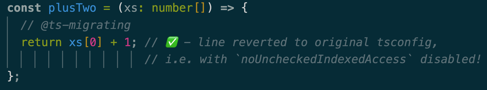

# `@ts-migrating` — Progressively Upgrade `tsconfig.json`

🚀 **TypeScript keeps evolving — and your `tsconfig` should too.**

This plugin lets you enable your desired `compilerOptions` (e.g. `strict`, `noUncheckedIndexedAccess`, `erasableSyntaxOnly`) across your entire codebase, while selectively disabling problematic lines.

Upgrading `tsconfig` often breaks existing code, and fixing all errors at once is unrealistic.

**`@ts-migrating`** helps your team migrate to a desired `tsconfig` gradually and safely.

> I chose `@ts-migrating` (rather than `@ts-migration`) to better reflect the plugin’s progressive and incremental philosophy.

## 🤖 How does this work?

`@ts-migrating` is a TypeScript plugin that lets you **enable your target tsconfig during development** (in IDEs or editors that use the [TypeScript Language Service](https://github.com/microsoft/typescript/wiki/Using-the-Language-Service-API)) and in CI — **without affecting `tsc` or your production build**.

The philosophy behind the plugin follows three simple steps:

1. 🛑 **Prevention**

   * Errors from your target config are surfaced during development and in CI.
   * This ensures no new violations are introduced into the codebase.

2. 🔧 **Reduction**

   * Lines marked with `@ts-migrating` will still be typechecked with your original `tsconfig`. Ensuring type-safety throughout.
   * Developers can progressively fix these lines, reducing violations over time.

3. ✅ **Migration**

   * Once all violations are fixed, no `@ts-migrating` directives remain.
   * At this point, you're ready to fully adopt the new tsconfig — and the plugin has served its purpose.

## 📚 Overview

`@ts-migrating` consists of two parts:

1. 🔌 **[TypeScript Language Service Plugin](https://github.com/microsoft/TypeScript/wiki/Writing-a-Language-Service-Plugin)**

   * Enables IDEs to show errors from the `tsconfig` you're migrating to.
   * Revert lines marked with `@ts-migrating` to be type-checked with your original `tsconfig`.

2. 🖥️ **Standalone CLI: `ts-migrating`**

   * `ts-migrating check`

     * Run `@ts-migrating`-aware type checking using your new `tsconfig`.
   * `ts-migrating annotate`

     * Automatically mark all errors caused by your new `tsconfig` with `@ts-migrating`.
     * ⚠️ Run this with a clean git state!!! This script will automatically add the `@ts-migrating` directive above every new TypeScript error introduced by your new `tsconfig`. There are edge cases where this will break the code, please review the changes carefully. It is recommended to run your formatter and linter afterwards.

## 🎪 Examples

* [Migrating to `strict`](./examples/strict-mode-migration/src/index.ts)
* [Migrating to `noUncheckedIndexedAccess`](./examples/no-unchecked-indexed-access-migration/src/index.ts):

  | Without `@ts-migrating` | With `@ts-migrating` |
  | ----------------------- | -------------------- |
  |   |   |

* [Migrating to `erasableSyntaxOnly`](./examples/erasable-syntax-only-migration/src/index.ts)

## 📦 Install and Setup

This project does **NOT** require any IDE extensions. It relies purely on TypeScript's own Language Service, so it works on most IDEs and editors that support TypeScript (e.g., VSCode, WebStorm).

To install:

```bash
cd my-cool-project
npm install -D ts-migrating
```

In your existing `tsconfig.json`, add the plugin:

```jsonc
{
  // ...
  "compilerOptions": {
    // ...
    "plugins": [
      {
        "name": "ts-migrating",
        "compilerOptions": {
          // ... put the compiler options you wish to migrate to, for example:
          "strict": true
        }
      }
    ]
    // ...
  }
  // ...
}
```

ℹ️ *Note: `plugins` only affect the TypeScript Language Service (used by IDEs). They do **not** impact `tsc` or your build.*

🎉 Your codebase is now ready!

### ✅ Verify the Setup

#### 🧑‍💻 In your IDE

* Restart the IDE, or just the TS server.
* Confirm that type errors now reflect the new `compilerOptions`. For example, when migrating to strict mode, verify that strict-specific errors appear.
* Add `// @ts-migrating` before a line with an error — the error should disappear in the IDE.

#### 🖥 In the terminal

* Run:

  ```bash
  npx ts-migrating check
  ```

  You should see errors from the new config, excluding those marked with `@ts-migrating`.

### ✨ Optional Next Steps

* Run `npx ts-migrating annotate` to automatically annotate newly introduced errors with `// @ts-migrating`.
* Replace your CI type-check step with `npx ts-migrating check` to prevent unreviewed errors from slipping through.

## API

You can use this project programmatically. This can be useful if you would like to have custom integrations, for example: reporting error counts to dashboard etc.

Currently there are only 2 functions exposed, [`getSemanticDiagnosticsForFile`](./src/api/getSemanticDiagnostics.ts) and [`isPluginDiagnostic`](./src/api/isPluginDiagnostic.ts). You can import them via `ts-migrating/api`, e.g.

```ts
import { getSemanticDiagnosticsForFile, isPluginDiagnostic } from 'ts-migrating/api';

getSemanticDiagnosticsForFile('path/to/file.ts') // returns all diagnostics using your new tsconfig, including non-plugin ones
  .filter(isPluginDiagnostic) // removes all non-plugin diagnostics
```

You could technically also import from `ts-migrating/cli` and `ts-migrating` (the ts plugin itself) too.

## 📣 Shoutout

This project wouldn't be possible without inspiration from:

* [allegro/typescript-strict-plugin](https://github.com/allegro/typescript-strict-plugin):
  Especially for revealing the undocumented [`updateFromProject` option](https://github.com/allegro/typescript-strict-plugin/blob/master/src/plugin/utils.ts#L28-L32) which helped fix a critical issue with the standalone script. [You can find out more here](./src/plugin/mod.ts#L31)).

## 👤 Author

YCM Jason
